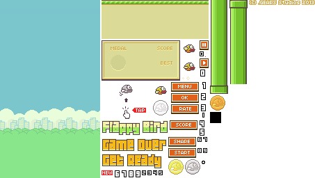

# 2D Game 의 유용한 정보

## 이미지 와 스프라이트

많은 게임들 특히 2D 게임에서는 이미지를 스프라이트라는 것을 이용하여 
다룬다.

> 스프라이트 => 게임등에서 2차원 비트맵 개체를 가리키는 용어

**스프라이트 아틀라스**

게임에서 이미지 파일은 매우 큰 파일이다.

그래서 아틀라스 이미지라는 것을 쓴다.

> 하나의 이미지로 여러개의 이미지를 합쳐두고 쪼개서 쓴다

유니티에서는 스프라이트 에디터를 이용해서 이미지를 쪼갤수가있다.

표준단위 (Pixel per unit)
> 유니티에서는 1m 의 몇 픽셀이 있느냐

이미지의 크기의 기준을 정할 수 있다.

2의 배수로 설정하여 계산속도에 이득을 볼수 있다.

## Layers

2D 에서는 z 값이 없기때문에 어떤 오브젝트가 앞에올지 뒤에올지를 정하기 힘들다.

그것을 정하기위해 Sorting Layer 를 설정해서 사용한다.

