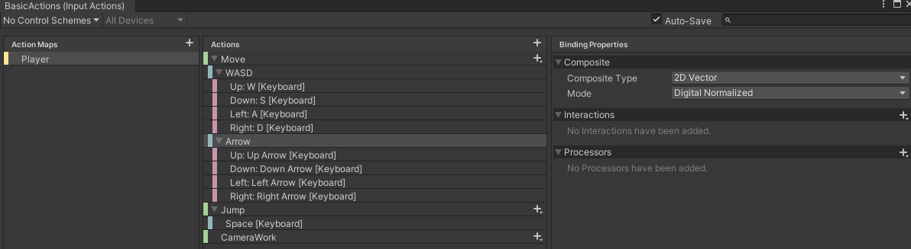

# Unity Basic Functions And Usages

유니티를 사용할때 기본적으로 알아야하는 함수들과 설명

## 목차

* [GameObject 관련 함수들](#GameObject-관리)
* [입력 관련 함수들](#사용자-입력-관련-함수)
* [TransForm](#Transform-Functions)

## GameObject 관리

## 1. gameObject 

```cs
public class UnityBasic : MonoBehaviour
{
	[Header("This GameObject")]
	public GameObject thisGameObject;
	
	private void Start()
	{
		GameObjectBasic();
	}

	void GameObjectBasic()
	{
		// <게임오브젝트 접근>
		// 컴포넌트가 붙어있는 게임오브젝트는 gameObject 속성을 이용하여 접근가능
		thisGameObject = gameObject;                // 컴포넌트가 붙어있는 게임오브젝트
	}
}
```

gameObject는 유니티의 모든 컴포넌트가 포함하고있다. (MonoBehaviour 를 상속하기때문)

위 코드는 해당 오브젝트가 start 할때 본인 스스로를 게임오브젝트를 세팅했지만

굳이 그렇게 안해도 gameObject로 접근가능하다.

**게임오브젝트 구성요소**

게임오브젝트에서 접근가능한 속성들

- name			: 게임오브젝트의 이름
- active		: 게임오브젝트의 활성화 여부, 비활성화인 경우 씬에 없는 게임오브젝트로 취급됨
- static		: 게임오브젝트의 정적상태 여부, 런타임 당시 변경되지 않는 데이터를 지정하여 최적화
- tag			: 게임오브젝트의 태그, 게임오브젝트를 특정하기 위한 수단으로 사용
- layer		: 게임오브젝트의 레이어, 씬에서 게임오브젝트를 분리하는 기준 (카메라의 선별적 표현, 충돌 그룹, 레이어 마스크 등에 사용)
- component	: 게임오브젝트에 포함된 기능모듈, 게임오브젝트는 컴포넌트를 담기위한 컨테이너 역할


## 2. Find(strign name)

```cs
		//..중략
		// <씬 내의 게임오브젝트 탐색>
		findWithName = GameObject.Find("FindGameObject");           // 이름으로 찾기
		findWithTag = GameObject.FindGameObjectWithTag("MyTag");    // 태그로 하나 찾기
		findsWithTag = GameObject.FindGameObjectsWithTag("MyTag");	// 태그로 모두 찾기
		//..중략
```
Find 함수는 이름 기준(GameObject의 name 속성)으로 해당하는 오브젝트를 찾는다.

만약 이름이 똑같으면 가장 먼저 찾은 객체를 돌려준다.

FindGameObjectWithTag 함수를 사용하여 태그 기준으로도 찾을 수 있다.


## 3. Desroty(object)

```cs
Destroy(destroyGameObject);
```
destroyGameObject 는 삭제할 오브젝트의 변수명이다.

매개변수를 object 라고 해둔 이유는 매개변수로 오브젝트들을 받을수 있어서이다.

> Unity 오브젝트들은 모두 매개변수로 들어 갈 수있다.

이를 통해 스크립트에서 오브젝트를 삭제 할 수 있다.

>당연히 new 를 통해 게임 오브젝트를 생성 할 수 있다.

```cs
Destroy(destroyGameObject , 5f);
```

5초 후에 삭제 하는 방식 도 있다.


## 4. GetComponent<T>()

T => 가져올 컴포넌트의 클래스를 뜻한다. (제네릭 방식)

기본적으로 [오브젝트].GetComponent<T>() 형식으로 사용하며

오브젝트 안에 있는 컴포넌트 기준으로 값을 가져온다.

```cs
//중략..
		// GetComponent를 이용하여 게임오브젝트 내 컴포넌트 접근
		gameObjectGetComponent = GetComponent<AudioSource>();
		// 컴포넌트에서 GetComponent를 사용할 경우 부착되어 있는 게임오브젝트를 기준으로 접근
		componentGetComponent = GetComponent<AudioSource>();    // == gameObject.GetComponent<AudioSource>();

		component = otherGameObject.GetComponent<AudioSource>();					// 게임오브젝트의 컴포넌트 접근
		components = otherGameObject.GetComponents<AudioSource>();					// 게임오브젝트의 컴포넌트들 접근
		childComponent = otherGameObject.GetComponentInChildren<AudioSource>();		// 자식 게임오브젝트 포함 컴포넌트 접근
		childComponents = otherGameObject.GetComponentsInChildren<AudioSource>();	// 자식 게임오브젝트 포함 컴포넌트들 접근
		parentComponent = otherGameObject.GetComponentInParent<AudioSource>();		// 부모 게임오브젝트 포함 컴포넌트 접근
		parentComponents = otherGameObject.GetComponentsInParent<AudioSource>();	// 부모 게임오브젝트 포함 컴포넌트들 접근

		// <씬 내의 컴포넌트 탐색>
		findWithType = FindObjectOfType<Rigidbody>();								// 씬 내의 컴포넌트 하나 찾기
		findsWithType = FindObjectsOfType<Rigidbody>();								// 씬 내의 컴포넌트 모두 찾기

		// <컴포넌트 추가>
		// Rigidbody rigid = new Rigidbody();	// 가능하나 의미없음, 컴포넌트는 게임오브젝트에 부착되어 동작함에 의미가 있음
		Rigidbody rigid = addComponent.AddComponent<Rigidbody>();					// 게임오브젝트에 컴포넌트 추가

		// <컴포넌트 삭제>
		Destroy(destroyComponent);
//중략..
```

[Object].AddComponenet<T>();

AddComponenet 함수를 사용하면 스크립트 내에서 Object에 T 컴포넌트를 추가해줄 수 있다.


## 사용자 입력 관련 함수

사용자는 외부 장치를 이용하여 게임을 제어할 수 있음

유니티는 다양한 타입의 입력기기(키보드 및 마우스, 조이스틱, 터치스크린 등)를 지원한다.


## 특정한 장치를 기준으로 입력 감지

특정한 장치의 입력을 감지하기 때문에 여러 플랫폼에 대응이 어려움

### Input.GetKey , Input.GetMouseButton 함수들

```cs
		// 키보드의 입력감지
		if (Input.GetKey(KeyCode.Space)) // 스페이스 입력 확인
			Debug.Log("Space key is pressing");
		if (Input.GetKeyDown(KeyCode.Space))// 스페이스 가 눌린 순간
			Debug.Log("Space key is down");
		if (Input.GetKeyUp(KeyCode.Space))// 스페이스 가 눌리고 나서 땐 순간
			Debug.Log("Space key is up");

		// 마우스의 입력감지
		if (Input.GetMouseButton(0))
			Debug.Log("Mouse left button is pressing");
		if (Input.GetMouseButtonDown(0)) // 눌린 순간
			Debug.Log("Mouse left button is down");
		if (Input.GetMouseButtonUp(0)) // 땐 순간
			Debug.Log("Mouse left button is up");
```

## 여러 장치의 입력을 <입력매니저>를 통해 입력 감지

**InputManager**

여러 장치의 입력을 입력매니저에 이름과 입력을 정의
	
입력매니저의 이름으로 정의한 입력의 변경사항을 확인
	
유니티 에디터의 Edit -> Project Settings -> Input Manager 에서 관리

```cs
	private void InputByInputManager()
	{
		// 버튼 입력
		// Fire1 : 키보드(Left Ctrl), 마우스(Left Button), 조이스틱(button0)으로 정의됨
		if (Input.GetButton("Fire1"))
			Debug.Log("Fire1 is pressing");
		if (Input.GetButtonDown("Fire1"))
			Debug.Log("Fire1 is down");
		if (Input.GetButtonUp("Fire1"))
			Debug.Log("Fire1 is up");

		// 축 입력
		// Horizontal(수평) : 키보드(a,d / ←, →), 조이스틱(왼쪽 아날로그스틱 좌우)
		float x = Input.GetAxis("Horizontal");
		// Vertical(수직) : 키보드(w,s / ↑, ↓), 조이스틱(왼쪽 아날로그스틱 상하)
		float y = Input.GetAxis("Vertical");
	}
```

## 여러 장치의 입력을 <입력 시스템>을 통해 입력 감지

**InputSystem**

Unity 2019.1 부터 지원하게 된 입력방식

**유니티 패키지 매니저에서 unity Resistry 에 InputSystem 를 설치해 주면 사용가능하다.**

컴포넌트를 통해 입력의 변경사항을 확인

GamePad, JoyStick, Mouse, Keyboard, Pointer, Pen, TouchScreen, XR 기기 등을 지원

> 유니티 에셋스토어에 Oculus Integration 에셋을 이용해도 오큘러스 vr 을 입력매니저로 사용가능 하게 도와주지만
><br/> 업데이트 중지 되었기 때문에 두개다 알아둬야한다.


```cs
	private void InputByInputSystem()
	{
		// InputSystem은 이벤트 방식으로 구현됨
		// Update마다 입력변경사항을 확인하는 방식 대신 변경이 있을 경우 이벤트로 확인
		// 메시지를 통해 받는 방식과 이벤트 함수를 직접 연결하는 방식 등으로 구성
	}

	// Move 입력에 반응하는 OnMove 메시지 함수
	private void OnMove(InputValue value)
	{
		Vector2 input = value.Get<Vector2>();
	}
```

### Input System 사용법

* 유니티 패키지 매니저에서 unity Resistry 에 InputSystem 를 설치
* 입력을 받고자하는 오브젝트 에 Component로 추가해준다
* Actions 를 새로 만들거나 디폴트를 사용해준다.




## Transform Functions

* 게임오브젝트의 위치, 회전, 크기를 저장하는 컴포넌트
* 게임오브젝트의 부모-자식 상태를 저장하는 컴포넌트
* 게임오브젝트는 반드시 하나의 트랜스폼 컴포넌트를 가지고 있으며 추가 & 제거할 수 없음

### Translate

트랜스폼 이동

AddForce 와 다르게 위치이동이기 때문에 가속, 감속하는 느낌은 나지않는다.

게임 오브젝트는 만드시 트랜스폼 을 가지고 있기때문에 접근및 사용가능하다.

Translate : 트랜스폼의 이동 함수

```cs
	private void TranslateMove()
	{
		// 백터를 이용한 이동
		transform.Translate(Vector3.forward * moveSpeed * Time.deltaTime);
		// x,y,z를 이용한 이동
		transform.Translate(0, 0, moveSpeed * Time.deltaTime);
	}
```


트랜스폰의 이동 기준이 나뉘게되는데

월드맵 기준으로 , 로컬을 기준으로 , 다른 대상을 기준으로 이동을 할 수 있다.

```cs
	private void TransformMoveSpace()
	{
		// 월드를 기준으로 이동
		transform.Translate(1, 0, 0, Space.World);
		// 로컬을 기준으로 이동
		transform.Translate(1, 0, 0, Space.Self);
		// 다른 대상을 기준으로 이동
		transform.Translate(1, 0, 0, Camera.main.transform);
	}
```

### Ratation

트랜스폼의 회전

```cs
	// <트랜스폼 회전>
	// Rotate : 트랜스폼의 회전 함수
	private void Rotate()
	{
		// 축을 이용한 회전 (축을 기준으로 시계방향으로 회전)
		transform.Rotate(Vector3.up, rotateSpeed * Time.deltaTime);
		// 오일러를 이용한 회전
		transform.Rotate(Vector3.up * rotateSpeed * Time.deltaTime);
		// x,y,z를 이용한 회전
		transform.Rotate(0, rotateSpeed * Time.deltaTime, 0);
	}

	// <트랜스폼 회전 기준>
	private void RotateSpace()
	{
		// 월드를 기준으로 회전
		transform.Rotate(1, 0, 0, Space.World);
		// 로컬을 기준으로 회전
		transform.Rotate(1, 0, 0, Space.Self);
		// 위치를 기준으로 회전
		transform.RotateAround(Camera.main.transform.position, Vector3.up, 1);
	}
```


```cs
// <트랜스폼 LookAt 회전>
	// LookAt : 위치를 바라보는 방향으로 회전
	private void LookAt()
	{
		// 위치를 바라보는 회전
		transform.LookAt(new Vector3(0, 0, 0));
		// 머리의 방향을 추가한 바라보는 회전
		transform.LookAt(new Vector3(0, 0, 0), Vector3.right);
	}
```


#### 트랜스폼 부모-자식 상태

 트랜스폼은 부모 트랜스폼을 가질 수 있음

부모 트랜스폼이 있는 경우 부모 트랜스폼의 위치, 회전, 크기 변경이 같이 적용됨

이를 이용하여 계층적 구조를 정의하는데 유용함 (ex. 팔이 움직이면, 손가락도 같이 움직임)

하이어라키 창 상에서 드래그 & 드롭을 통해 부모-자식 상태를 변경할 수 있음

```cs
	private void TransformParent()
	{
		GameObject newGameObject = new GameObject() { name = "NewGameObject" };

		// 부모 지정
		transform.parent = newGameObject.transform;

		// 부모를 기준으로한 트랜스폼
		// transform.localPosition	: 부모트랜스폼이 있는 경우 부모를 기준으로 한 위치
		// transform.localRotation	: 부모트랜스폼이 있는 경우 부모를 기준으로 한 회전
		// transform.localScale		: 부모트랜스폼이 있는 경우 부모를 기준으로 한 크기

		// 부모 해제
		transform.parent = null;

		// 월드를 기준으로한 트랜스폼
		// transform.localPosition == transform.position	: 부모트랜스폼이 없는 경우 월드를 기준으로 한 위치
		// transform.localRotation == transform.rotation	: 부모트랜스폼이 없는 경우 월드를 기준으로 한 회전
		// transform.localScale								: 부모트랜스폼이 없는 경우 월드를 기준으로 한 크기
	}
```

### Quarternion & Euler

Quarternion	: 유니티의 게임오브젝트의 3차원 방향을 저장하고 이를 방향에서 다른 방향으로의 상대 회전으로 정의

기하학적 회전으로 짐벌락 현상이 발생하지 않음

EulerAngle	: 3축을 기준으로 각도법으로 회전시키는 방법 

직관적이지만 짐벌락 현상이 발생하여 회전이 겹치는 축이 생길 수 있음
	
> 짐벌락 : 같은 방향으로 오브젝트의 두 회전 축이 겹치는 현상


Quarternion을 통해 회전각도를 계산하는 것은 직관적이지 않고 이해하기 어려움

보통의 경우 쿼터니언 -> 오일러각도 -> 연산진행 -> 결과오일러각도 -> 결과쿼터니언 과 같이 연산의 결과 쿼터니언을 사용함