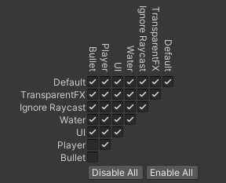
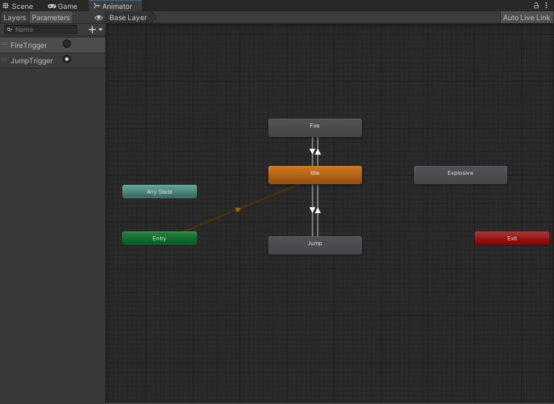

# 유니티 기본 구조 및 이론

#목차

[0. 기본 구조](#기본-구조)

[1. Components](#Components)

[2. MonoBehaviour](#MonoBehaviour)
 - [2.1 스크립트 직렬화 기능](#스크립트-직렬화-기능)
 - [2.2 유니티 메시지 이벤트 함수](#유니티-메시지-이벤트-함수)
 - [2.3 코루틴 기능](#코루틴-기능)

 [3. PreFab 프리팹](#prefab)

 [4. Collision 충돌체](#Collision)

 [5. 충돌체의 종류들](#collision-detection-types)

 [6. 오디오](#Audio)

 [7. 애니메이션](#animation)

 [8. UI](#UI)

 [9. Scene](#Scene)

## 기본 구조

유니티 엔진은 내부적으로 네이티브 C/C++ 로 빌드 되었지만, 

상호작용 하는 C# 래퍼를 포함하고있다 (스크립팅을 하여 사용할 수 있다.)

구조상 유니티는 컴포넌트 구조 기반으로 만들어진 게임 엔진이다.

컴포넌트 형식은 어떤 함수가 있는지 구조상 예상이 안된다.
> 상속 구조에서는 부모 아래 자식들은 부모의 함수를 가지고있다고 예상을 할 수 가 있다.

그래서 유니티는 추가로 메시지 시스템이라는 걸 사용한다.

메시지 시스템의 기능중하나인 메시지 브로드캐스팅 을 통해서 여러 개의 컴포넌트를 관리 및 사용한다.

>Update() 를 실행시킬때 모든 오브젝트에 Update() 실행하라고 메시지를 날림 / update가 없으면 반응안함

이러한 기능이 가능한 이유는 유니티의 모든 컴포넌트가 MonoBehavior를 상속하여 만들어 져서 이다.

**참고**

계층 구조 설계 의 문제점들을 보완하고자 컴포넌트 기반의 설계 방법이 생겼다.

컴포넌트 기반 설계는 게임 오브젝트가 해야 할 기능들을 각각 별도의 객체로 생성하여

게임에 여러 클래스 및 게임 오브젝트의 비대화 등의 문제점들을 해결하는 설계이다.

즉 컴포넌트 기반 설계에서는 오브젝트 마다 필요한 기능있다면 그 기능을 컴포넌트로 만들고

컴포넌트를 붙히는(포함시키는) 방식으로 게임 오브젝트가 만들어진다.


### GameObject

**게임오브젝트 (GameObject) 란**

- 씬을 구성하는 모든 오브젝트의 기본 클래스이다.

- 게임오브젝트만으로는 독자적인 기능이 없음. 실질적인 기능은 컴포넌트들이 수행한다.

- 게임오브젝트는 컴포넌트들을 가지기 위한 컨테이너이다.

**게임오브젝트 구성요소**

- name			: 게임오브젝트의 이름
- active		: 게임오브젝트의 활성화 여부, 비활성화인 경우 씬에 없는 게임오브젝트로 취급됨
- static		: 게임오브젝트의 정적상태 여부, 런타임 당시 변경되지 않는 데이터를 지정하여 최적화
- tag			: 게임오브젝트의 태그, 게임오브젝트를 특정하기 위한 수단으로 사용
- layer		: 게임오브젝트의 레이어, 씬에서 게임오브젝트를 분리하는 기준 (카메라의 선별적 표현, 충돌 그룹, 레이어 마스크 등에 사용)
- component	: 게임오브젝트에 포함된 기능모듈, 게임오브젝트는 컴포넌트를 담기위한 컨테이너 역할

### Components

- 특정한 기능을 수행할 수 있도록 구성한 작은 기능적 단위
- 게임오브젝트의 작동과 관련한 부품
- 게임오브젝트에 추가, 삭제하는 방식의 조립형 부품


### MonoBehaviour 

-  컴포넌트를 기본클래스로 하는 클래스로 유니티 스크립트가 파생되는 기본 클래스
-  게임 오브젝트에 스크립트를 컴포넌트로서 연결할 수 있는 구성을 제공
-  스크립트 직렬화 기능, 유니티메시지 이벤트를 받는 기능, 코루틴 기능을 포함함

> 컴포넌트의 일종이며 추가적으로 기능이 있다.

### MonoBehaviour 컴포넌트와 달리 추가된 기능

#### 스크립트 직렬화 기능
- 인스펙터 창에서 컴포넌트의 맴버변수 값을 확인하거나 변경하는 기능
- 컴포넌트의 값형식 데이터를 확인하거나 변경
- 컴포넌트의 참조형식 데이터를 드래그 앤 드랍 방식으로 연결

> 직렬화 가능한 데이터 
><br> 1. 기본 자료형, 기본 자료형의 선형자료구조, 참조형 데이터
><br> 2. 유니티의 자료형, 유니티 컴포넌트, 유니티 이벤트

어트리뷰트
- 클래스, 프로퍼티 또는 함수 위에 명시하여 특별한 동작을 나타낼 수 있는 마커

```cs
	[Header("구분용헤더")] // 인스펙터창에 이름 짓기 및 분할용
	
	[Space(30)] // 인스펙터창에 빈공간 만들기

	[SerializeField]
	private int privateValue; // private 이지만 인스펙터창에 보이게
	[HideInInspector]
	public int publicValue; // public 이지만 인스펙창에 안보이게

	[Range(0, 10)]
	public float rangeValue; // 0~10 값만 가질 수 있게

	[TextArea(3, 5)]
	public string textField; // 3줄~5줄 로 확보 그이상넘어가면 스크롤
```

#### 유니티 메시지 이벤트 함수

- 유니티가 보내는 메시지에 반응하는 함수
- 포함할 경우 유니티메시지에 반응하지만, 포함하지 않을 경우 무시함
- 스크립트는 유니티 엔진이 보내는 메시지에 반응하여 자신의 행동을 정의

```cs
	
	private void Awake()
	{
		// 스크립트가 씬에 포함되었을 때 1회 호출되는 함수
		// 스크립트가 비활성화 되어 있는 경우에도 호출됨

		// 역할 : 스크립트가 필요로 하는 초기화 작업 진행
		//		  (게임상황과 무관한 초기화 작업)
		// ex) 데이터 초기화, 컴포넌트 연결
		Debug.Log("Awake");
	}

	private void OnEnable()
	{
		// 스크립트가 활성화될 때마다 호출

		// 역할 : 스크립트가 활성화 되었을 때 작업 진행
		Debug.Log("OnEnable");
	}

	private void Start()
	{
		// 스크립트가 씬에 처음으로 Update하기 직전에 1회 호출됨
		// 스크립트가 비활성화된 경우 호출되지 않음

		// 역할 : 스크립트가 필요로 하는 초기화 작업 진행
		//		  (게임상황이 영향을 줄 수 있는 작업)
		// ex) 몬스터의 플레이어 타겟선정
		Debug.Log("Start");
	}

	private void Update()
	{
		// 게임의 프레임마다 호출

		// 역할 : 핵심 게임 로직 구현
		Debug.Log("Update");
	}

	private void LateUpdate()
	{
		// 씬의 모든 게임오브젝트의 Update가 진행된 후 호출

		// 역할 : 게임프레임의 진행 결과가 필요한 동작이 있는 기능 구현
		// ex) 플레이어의 위치가 결정된 후에 카메라의 위치 설정
		Debug.Log("LateUpdate");
	}

	private void FixedUpdate()
	{
		// 유니티의 물리설정 단위시간마다 호출 (기본 1초에 50번)
		// Update와 다르게 프레임당 연산과 단위시간이 일정
		// 단, 게임로직 등, 연산이 많은 작업을 FixedUpdate에 구현하지 않아야 함

		// 역할 : 성능과 프레임 드랍에 영향을 받지 않아야 하는 작업
		// ex) 물리적 처리
		Debug.Log("FixedUpdate");
	}

	private void OnDisable()
	{
		// 스크립트가 비활성화될 때마다 호출

		// 역할 : 스크립트가 비활성화 되었을 때 작업 진행
		Debug.Log("OnDisable");
	}

	private void OnDestroy()
	{
		// 스크립트가 삭제되었을 경우 호출

		// 역할 : 스크립트의 마무리 진행
		Debug.Log("OnDestory");
	}
```

#### 코루틴 기능

* 작업을 다수의 프레임에 분산할 수 있는 비동기식 작업
* 반복가능한 작업을 분산하여 진행하며, 실행을 일시정지하고 중단한 부분부터 다시시작할 수 있음
* 단, 코루틴은 스레드가 아니며 코루틴의 작업은 여전히 메인 스레드에서 실행


> Unity에서 코루틴은 실행을 일시 정지하고 제어를 Unity에 반환하지만 
><br/> 중단한 부분에서 다음 프레임을 계속할 수 있는 메서드입니다.
><br/> - From Unity Documentation

쉽게 말해 Update() 말고 따로 뭔가 작업을 하고싶을때 만들 수 있는 방법중에 하나다.

```cs
	// <코루틴 진행>
	// 반복가능한 작업을 StartCorouine을 통해 실행
	IEnumerator SubRoutine()
	{
		for (int i = 0; i < 10; i++)
		{
			yield return new WaitForSeconds(1);
			Debug.Log("코루틴 1초");
		}
	}

	private Coroutine routine;
	private void CoroutineStart()
	{
		routine = StartCoroutine(SubRoutine());
	}

	// <코루틴 종료>
	// StopCoroutine을 통해 진행 중인 코루틴 종료
	// StopAllCoroutine을 통해 진행 중인 모든 코루틴 종료
	// 반복가능한 작업이 모두 완료되었을 경우 자동 종료
	// 코루틴을 진행시킨 스크립트가 비활성화된 경우 자동 종료

	private void CoroutineStop()
	{
		StopCoroutine(routine);		// 지정한 코루틴 종료
		StopAllCoroutines();		// 모든 코루틴 종료
	}

	// <코루틴 시간 지연>
	// 코루틴은 시간 지연을 정의하여 반복가능한 작업의 진행 타이밍을 지정할 수 있음
	IEnumerator CoRoutineWait()
	{
		yield return new WaitForSeconds(1);     // n초간 시간지연
		yield return null;						// 시간지연 없음
	}

```

## PreFab

* 미리 만들어 놓은 게임오브젝트, 템플릿
* 프리팹 시스템을 이용하여 게임오브젝트를 생성, 설정 및 저장할 수 있음
* 처음부터 씬에 존재하지 않던 게임오브젝트를 런타임 시점에 생성하려는 경우 사용

**프리팹 생성하는 방법**

유니티 하이어라키 창의 게임오브젝트를 프로젝트 창을 

드래그 & 드롭하여 프리팹에셋 생성

**프리팹의 특징**

* 게임오브젝트를 프리팹화 시킨 프리팹에셋은 게임오브젝트의 모든 컴포넌트, 속성값, 자식 게임오브젝트를 가지고 있음
* 프리팹에셋을 게임씬에 추가할 경우 프리팹인스턴스로 생성
* 프리팹에셋의 변경사항은 프리팹인스턴스에게 자동으로 반영
* **프리팹인스턴스에 변경사항이 있을 경우 해당 변경사항은 프리팹인스턴스에 영향을 받지 않음**
* 프리팹에셋을 클래스, 프리팹인스턴스를 클래스의 인스턴스로 볼 수 있음


## Collision

물리적 충돌을 위해 게임 오브젝트의 (콜라이더) 모양을 정의

게임오브젝트의 메시와 똑같을 필요는 없다.

충돌체가 충돌상황에 있을 경우 유니티 메시지를 받아 상황을 확인 및 컨트롤할수 있다.


```cs
	// <유니티 충돌 메시지>
	private void OnCollisionEnter(Collision collision)
	{ // 충돌체가 충돌체에 겹쳤을때
		Debug.Log("OnCollisionEnter");
	}

	private void OnCollisionStay(Collision collision)
	{// 충돌체가 충돌체에 겹치고있을때
		Debug.Log("OnCollisionStay");
	}

	private void OnCollisionExit(Collision collision)
	{// 충돌체가 충돌체에서 충돌이 끝나면 한번 
		Debug.Log("OnCollisionExit");
	}
```

트리거 충돌체

* 하나의 충돌체가 충돌을 일으키지 않고 다른 충돌체의 공간에 들어가는 것을 감지
* 트리거가 겹쳐진 상황에 있을 경우 유니티 트리거 메시지를 받아 상황을 확인 및 컨트롤 가능하다.

```cs
	// <유니티 트리거 메시지>
	private void OnTriggerEnter(Collider other)
	{
		Debug.Log("OnTriggerEnter");
	}

	private void OnTriggerStay(Collider other)
	{
		Debug.Log("OnTriggerStay");
	}

	private void OnTriggerExit(Collider other)
	{
		Debug.Log("OnTriggerExit");
	}
```

## Collision detection types


**<충돌체 종류>**

1. 정적 충돌체 (Static Collider)
* Rigidbody가 없는 충돌체, 외부에 힘에 움직이지 않음
* 절대로 움직이지 않는 지형, 구성요소에 주로 사용

2. 리지드바디 충돌체 (Rigidbody Collider)
* Rigidbody가 있는 충돌체, 외부에 힘을 받아 움직임
* 충돌할 수 있으며 물리를 사용하는 게임 내 가장 흔히 사용되는 충돌체에 사용

3. 키네마틱 충돌체 (Kinematic Collider)
* Kinematic Rigidbody가 있는 충돌체, 외부의 힘에 반응하지 않음
* 움직이지만 외부 충격에는 밀리지 않는 물체(밀어내는 장애물, 미닫이문 등)등 에 사용
* kinematic 상태를 활성화/비활성화 하여 움직임 여부를 설정할 경우 사용


충돌체 상호작용 

**충돌시 충돌 메시지 전송**

|| 정적 콜라이더                       | 리지드바디 콜라이더 | 키네마틱 리지드바디 콜라이더 | 정적 트리거 콜라이더 | 리지드바디 트리거 콜라이더 | 키네마틱 리지드바디 트리거 콜라이더  |
|-------------------------------------|---------------------|------------------------------|----------------------|----------------------------|-------------------------------------|
| 정적 콜라이더                       |                     | Y                            |                      |                            |                                     |  
| 리지드바디 콜라이더                 | Y                   | Y                            | Y                    |                            |                                     |   
| 키네마틱 리지드바디 콜라이더        |                     | Y                            |                      |                            |                                     |   
| 정적 트리거 콜라이더                |                     |                              |                      |                            |                                     |   
| 리지드바디 트리거 콜라이더          |                     |                              |                      |                            |                                     |   
| 키네마틱 리지드바디 트리거 콜라이더 |                     |                              |                      |                            |                                     |    


**충돌시 트리거 메시지가 전송**

|| 정적 콜라이더                       | 리지드바디 콜라이더 | 키네마틱 리지드바디 콜라이더 | 정적 트리거 콜라이더 | 리지드바디 트리거 콜라이더 | 키네마틱 리지드바디 트리거 콜라이더 | 
|-------------------------------------|---------------------|------------------------------|----------------------|----------------------------|-------------------------------------|
| 정적 콜라이더                       |                     |                              |                      |                            | Y                                   | Y |
| 리지드바디 콜라이더                 |                     |                              |                      | Y                          | Y                                   | Y |
| 키네마틱 리지드바디 콜라이더        |                     |                              |                      | Y                          | Y                                   | Y |
| 정적 트리거 콜라이더                |                     | Y                            | Y                    |                            | Y                                   | Y |
| 리지드바디 트리거 콜라이더          | Y                   | Y                            | Y                    | Y                          | Y                                   | Y |
| 키네마틱 리지드바디 트리거 콜라이더 | Y                   | Y                            | Y                    | Y                          | Y                                   | Y |


레이어 기반 충돌 감지

게임오브젝트의 레이어를 활용하여 충돌체간의 충돌가능 여부를 설정 가능
>edit -> ProjectSettings -> Physics 에서 설정 




## Audio

게임월드에서 플레이어에게 들려주는 청각적인 요소

* 소리를 듣는 AudioListener 컴포넌트와 소리를 발생시키는 AudioSource 컴포넌트
* 소리들의 결과를 믹스, 효과적용 및 마스터링 작업하는 Audio Mixer

<Audio Listener & Source>

* Audio Listener : 씬에서 주어진 오디오 소스로부터의 입력을 수신하여 사운드를 재생
					주로 씬에서 카메라에 부착되어 있으며, 대개 하나만 유지시킴

* Audio Source : 씬에서 오디오 클립을 재생
					오디오 클립을 재생하기 위한 다양한 오디오효과를 적용할 수 있음

*  Audio Mixer:
	다양한 오디오 소스 믹스, 효과 적용 및 마스터링 작업진행
    오디오의 그룹을 나누어 여러 효과를 적용하고 최종적으로 합치는 작업을 진행


## Animation

특정 오브젝트의 속성이 시간에 따라 변경되는 정보를 연속적으로 진행하는 시스템

스파인,프레임,휴머노이드 애니메이션 등의 시스템을 이용할 수 있다.

유니티는 기본적으로는 메카님이라고 불리는 시스템을 사용한다.

**<애니메이션 구성요소>**
* 애니메이션 클립 : 특정 오브젝트의 속성이 시간에 따라 변경되는 정보의 에셋
* 애니메이터 컨트롤러 : 애니메이션 클립들의 구조화 및 플로우차트를 가지는 시스템
* 애니메이터 : 애니메이터 컨트롤러, 아바타, 애니메이터 속성을 가지는 컴포넌트

**<애니메이션 클립>**
* 애니메이션 뷰를 통해 애니메이션 클립의 시간에 따라 변경되는 정보를 편집
* 녹화모드 기능을 통해 게임오브젝트의 속성 변경을 기록하며 편집 가능
* 키프레임 : 애니메이션 클립의 프레임 당시의 속성값을 저장
* 커브 : 키프레임간의 보간을 진행

**<애니메이터 컨트롤러>**
* 특정 캐릭터나 다른 게임오브젝트 애니메이션 클립들을 관리 및 유지
* 컨트롤러는 다양한 애니메이션 상태와 상태 간 전환을 상태머신을 이용하여 관리
* 상태간의 전환조건을 파라매터를 통해 지정하며, 전환간의 보간을 진행



## UI

사용자 인터페이스
 
유저가 프로그램과 의사소통을 할 수 있도록 만든 매개체

버튼, 스크롤, 텍스트 등 소프트웨어적으로 유니티와 사용작용 할 수 있는 수단


**캔버스**

* UI 요소들을 가지고 있는 UI 구성틀
* 모든 UI 요소는 캔버스 안에 위치해야 함
* 위치가 겹칠 경우 나중에 그려지는 UI 요소가 이전 UI 요소를 덮어씀

**기본 레이아웃**

* Rect Transform : UI 컴포넌트의 기본 구성요소로 일반 Transform 컴포넌트 대신 사용됨
					Rect Transform은 Transform을 상속한 서브클래스로 Transform의 모든 기능이 있음
					추가적으로 사각형의 크기를 지정하기 위한 폭, 높이, UI의 구성인 앵커, 피벗이 있음
* 앵커(Anchor) : 자식컴포넌트의 부모 상대위치의 설정 기준 적용
* 피벗(Pivot) : 위치, 회전, 크기의 중심 위치

> Rect Transform 과 앵커를 이용해 다양한 크기의 스크린에 
> <br> 적용 가능한 UI 를 만들 수 있다.

**UI 컴포넌트**

* 비주얼 컴포넌트 : 정보 표시만을 위한 컴포넌트 (텍스트, 이미지, 등)
* 상호작용 컴포넌트 : 마우스 및 터치 이벤트 등을 사용하여 이루어지는 상호작용을 처리하는 UI 시스템의 컴포넌트
					  상호작용 컴포넌트 자체가 사용자에게 보여지지 않으므로, 하나 이상의 비주얼 컴포넌트와 결합하여 사용
					  (버튼, 토글, 토글 그룹, 슬라이더, 스크롤바, 드롭다운, 입력필드, 스크롤뷰 등)
					  입력 이벤트를 감지하기 위해서 게임씬 내에 Event System 컴포넌트가 필요함


 **Event System**
* 키보드, 마우스, 터치, 커스텀 입력 등 입력 기반 어플리케이션의 오브젝트에 이벤트를 전송하는 방법
* UI를 추가하는 경우 자동으로 씬에 포함되지만, 런타임 당시에 UI를 생성하는 경우에 주의

> Canvas 에 Canvas Scaler 컴포넌트에 Scale with screen size 세팅으로 동적 으로 UI 크기가 정해지게
> <br/> 만드는 것이 다양한 스크린 크기에 대응 할 수 있는 UI로 만들 수 있다.

## Scene


씬 (Scene)

* 유니티에서 게임월드를 구성하는 단위
* 프로젝트에 원하는 수만큼 씬을 포함할 수 있음
* 단일 씬에서 간단한 게임을 빌드할 수도 있으며, 여러 씬을 전환하며 게임을 진행 할 수도 있음
* 다중 씬을 이용하여 여러 씬을 동시에 열어 같은 게임월드에서 사용도 가능함


빌드 설정

* 씬에 대한 스크립팅 전, 게임 빌드 설정에서 씬을 포함시켜야 해당 씬을 사용 가능

> File -> Build Settings -> Scene In Build 에 포함시킬 씬을 추가 해주면 된다.
> <br/> 이러한 추가된 씬의 순서를 인덱스로 사용하거나 이름을 사용하여 씬을 추가및 변환 등을 할 수 있다.

**사용하는 함수**

```cs
	// <씬 로드>
	public void ChangeSceneByName(string sceneName)
	{
		SceneManager.LoadScene(sceneName, LoadSceneMode.Single);
	}

	public void ChangeSceneByIndex(int sceneIndex)
	{
		SceneManager.LoadScene(sceneIndex, LoadSceneMode.Single);
	}

	// <씬 추가>
	public void AddSceneByName(string sceneName)
	{
		SceneManager.LoadScene(sceneName, LoadSceneMode.Additive);
	}

	public void AddSceneByIndex(int sceneIndex)
	{
		SceneManager.LoadScene(sceneIndex, LoadSceneMode.Additive);
	}

	// <비동기 씬 로드>
	public void ChangeSceneASync(string sceneName)
	{
		// 비동기 씬 로드 : 백그라운드로 씬을 로딩하도록 하여 게임 중 멈춤이 없도록 함
		AsyncOperation asyncOperation = SceneManager.LoadSceneAsync(sceneName);
		
		asyncOperation.allowSceneActivation = true;     // 씬 로딩 완료시 바로 씬 로드를 진행하는지 여부
		bool isLoad = asyncOperation.isDone;			// 씬 로딩이 완료되었는지 판단
		float progress = asyncOperation.progress;       // 씬 로딩률 확인
		asyncOperation.completed += (oper) => { };		// 씬 로딩 완료시 진행할 이벤트 추가
	}

	// <Don't destroy on load>
	// 씬의 전환에도 제거되지 않기 원하는 게임오브젝트의 경우 지워지지 않는 씬의 오브젝트로 추가하는 방법을 사용
	// (동작 방법은 다중 씬을 통한 로드시에 제거되지 않는 씬을 구성하는 방법)
	public void SetDontDestroyOnLoad(GameObject go)
	{
		DontDestroyOnLoad(go);
	}
```